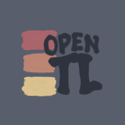
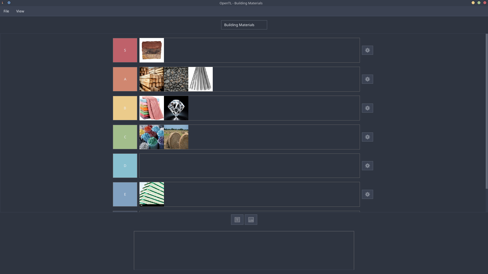

<br/>

<div align="center">
  
</div>

<br/>
<h3 align="center">
  A simple and straightforward Java-developed Tier List Maker
</h3>

<br/>

<div align="center">
  
</div>

<div align="center">
  <p>
    <i>graphical interface built manually using the JavaFX library<i/>
  </p> 
</div>

## Features

- **Visual tier list creation** — Drag and drop items into tier categories
- **Customizable tiers** — Add, remove, and rename tiers as needed
- **Mouse-based interaction** — Intuitive point-and-click controls (keyboard support coming soon ?)

---

## Requirements

- **Java 25** or later

---

## Installation

### Quick Start

#### Linux

**Download the latest release** from the [releases](https://github.com/flynnzzz/OpenTierList/releases) page. The release includes:

- The application JAR file
- Required JavaFX runtime JARs and binaries
- The `otl.sh` bash script for easy execution

Once downloaded, run the application using the provided bash script:

```bash
./otl.sh
```

### Running the Downloaded JAR Directly

If you prefer to run the JAR without the script:

```bash
java --module-path lib --add-modules javafx.controls -jar target/opentierlist.jar
```

---

## Building from Source

### Prerequisites

- **Java 25** or later
- **Maven 3.6+**

### Clone and Build

1. **Clone the repository:**

  ```bash
  git clone https://github.com/flynnzzz/OpenTierList.git
  cd OpenTierList
  ```

1. **Compile the project:**

  ```bash
  mvn clean compile
  ```

### Running the Application

After compilation, you can run the application in two ways:

**Option 1: Using Maven directly**

```bash
mvn javafx:run
```

**Option 2: Package and run as a JAR**

```bash
mvn package
./otl.sh
```

The compiled JAR will be available in the `./target` directory.

---

## Usage

1. **Launch the application** using the bash script or Java command
2. **Add items** to your tier list as images
3. **Drag items** into tier categories to organize them
4. **Customize tiers** by renaming or adding new ones
5. **Save or export** your tier list

---

## Supported formats

The following **image formats** are supported for imported Tier List entries:

- *.png*
- *.jpg*
- *.jpeg*
- *.gif*

Tier Lists can be **saved** and later **loaded** as *.json* files (*.tson*).

---

## Development Notes

This project was created as a **learning exercise** to explore:

- JavaFX for GUI development
- Event handling and mouse interactions
- MVC architecture patterns
- Maven build automation

---

## Future TODOs and improvements

- Keyboard navigation and shortcuts
- Undo/redo functionality
- Better UI / model separation

---
